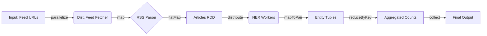

# Distributed Big Data Processor with Apache Spark ⚡

[](https://openjdk.org/)
[](https://spark.apache.org/)
[](https://maven.apache.org/)
[](https://spark.apache.org/docs/latest/cluster-overview.html)

A high-performance distributed system designed to ingest, parse, and analyze massive RSS feed datasets using **Apache Spark**. It implements a **MapReduce** architecture to perform Named Entity Recognition (NER) across a cluster of worker nodes, ensuring horizontal scalability.

---

## 🏗️ System Architecture

The system utilizes Spark's **RDD (Resilient Distributed Datasets)** abstraction to create a fault-tolerant processing pipeline.



### Key Engineering Features
* **Distributed Ingestion:** Parallelized HTTP requests using `JavaRDD<String> urlsRDD` to distribute network I/O load across workers.
* **Hierarchical Processing:** Uses `flatMap` to transform the Feed-level RDD into an Article-level RDD, allowing granular load balancing (one worker per article).
* **MapReduce Aggregation:** Implemented `reduceByKey()` for efficient entity counting, utilizing local combiners to minimize network shuffle.
* **Functional Paradigm:** Leverages pure functions and immutability to ensure thread safety without manual lock management.

---

## 🚀 Performance Benchmarking

Comparison between the sequential implementation and this distributed Spark implementation.

| Metric | Sequential Engine | Distributed Spark Engine | Analysis |
| :--- | :--- | :--- | :--- |
| **Execution Time** | ~9.7s | ~16.9s | Spark has initialization overhead (driver/executors startup). |
| **Scalability** | O(N) - Linear/Limited | **Horizontal Scaling** | Spark excels as dataset size ($N$) increases significantly. |
| **Concurrency** | Single Thread | **Multi-Node Cluster** | Automatic task distribution across available cores. |
| **Fault Tolerance** | None (Crash fails) | **Resilient (RDD lineage)** | Automatic partition reconstruction on failure. |

> **Engineering Insight:** While the sequential version is faster for small datasets due to JVM warm-up and Spark context overhead, the Spark architecture is designed to handle TB-scale datasets where the sequential approach would hit memory (OOM) and CPU bottlenecks.

---

## 🛠️ Technical Implementation

### 1. The Distributed Pipeline
```java
// 1. Ingestion: Partitioning URLs across the cluster
JavaRDD<String> urlsRDD = jsc.parallelize(urls, Math.min(urls.size(), 10));

// 2. Processing: Lazy evaluation pipeline
JavaRDD<NamedEntity> entitiesRDD = urlsRDD
    .map(this::downloadAndParseFeed)              // Distributes I/O
    .filter(Objects::nonNull)                     // Filters invalid feeds
    .flatMap(feed -> feed.getArticles())          // Flattens hierarchy
    .flatMap(article -> article.computeNamedEntities(heuristic)); // Distributes CPU heavy task

// 3. Aggregation: MapReduce execution
List<Tuple2<String, Integer>> results = entitiesRDD
    .mapToPair(entity -> new Tuple2<>(entity.getName(), 1))
    .reduceByKey(Integer::sum)                    // Shuffling & Reducing
    .collect();                                   // Action triggering the DAG
```

### 2. Functional Design Principles
This project applies **Functional Programming** concepts to solve distributed system challenges:
* **Immutability:** RDDs are immutable, eliminating race conditions common in shared-state concurrency models (like Actors).
* **Pure Functions:** Transformation logic is side-effect free, making the system deterministic and easier to debug.
* **Lazy Evaluation:** Transformations are optimized into a DAG (Directed Acyclic Graph) and only executed when an Action (`collect`) is called.

---

## 💻 Installation & Usage

### Prerequisites
* Java 17 (Required ` --add-opens` for Spark compatibility)
* Apache Spark 3.5.0
* Maven

### Building the Project
```bash
make compile
```

### Running the Cluster
Run the distributed version locally (simulating a cluster):
```bash
make run
```

Run with specific heuristics (NER algorithms):
```bash
make run HEURISTIC=-qh   # Quick Heuristic
make run HEURISTIC=-rh   # Random Heuristic
```

---

## 📂 Project Structure

```bash
├── src/
│   ├── SparkFeedFetcher.java   # Main Distributed Application (Driver)
│   ├── namedEntity/            # NER Logic (Serializable domain objects)
│   └── parser/                 # RSS Parsing Logic
├── config/
│   └── subscriptions.json      # Feed Sources
├── pom.xml                     # Maven Dependencies (Spark Core/SQL)
└── Makefile                    # Build automation
```

---

### 📝 Credits
Originally developed as a Capstone Project for **CS Paradigms** at **FaMAF - UNC**.
* **Team:** Nehuen Guevara, Ignacio Hernandez, Andres Villagra, Clemente Ivetta.